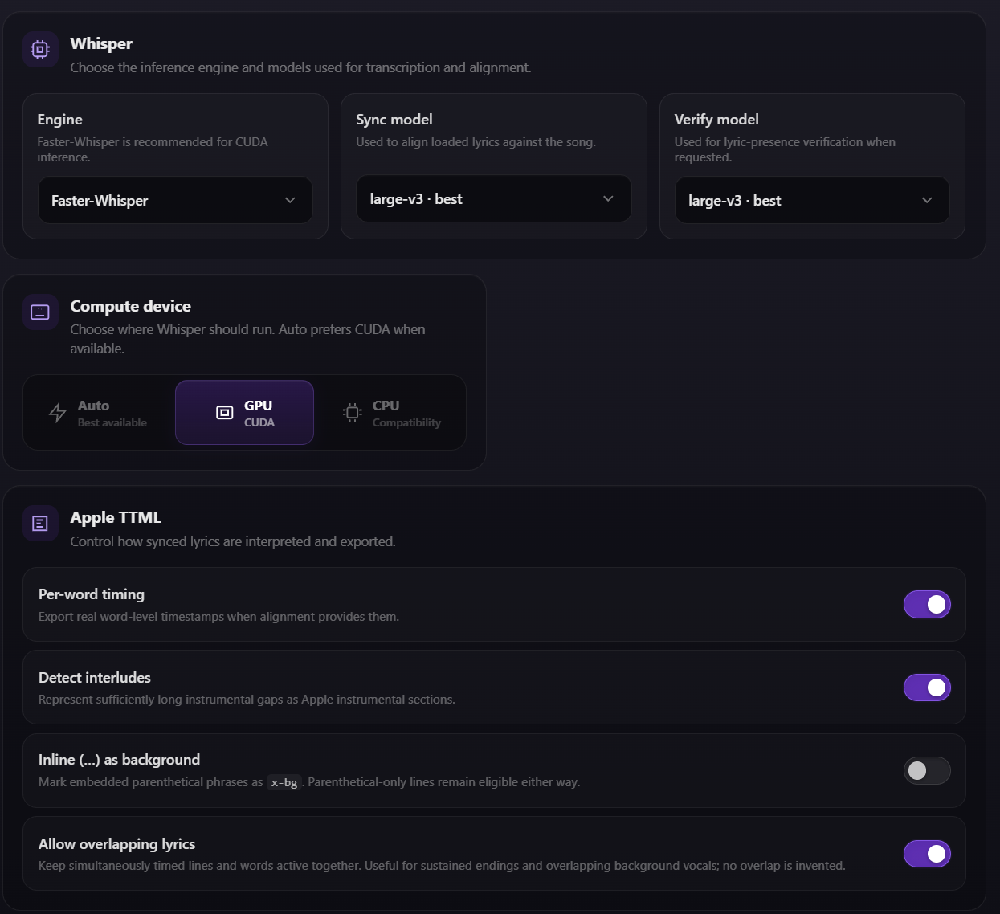

# WRLD Sync

A music player that pulls songs from [juicewrldapi.com](https://juicewrldapi.com), streams audio, and generates karaoke-style synced lyrics using local Whisper, with Apple TTML as the primary synced-lyrics format.

## Setup

**Windows:** double-click `start.bat`. First run sets up a virtual environment and installs everything (including PyTorch/Whisper); later runs are fast. If [uv](https://docs.astral.sh/uv/) is installed, the launcher uses it for much faster package installation and can use its managed Python when Python is not already on your PATH. Otherwise it falls back to Python 3.10+ and pip.

To install uv on Windows (recommended):

```powershell
winget install --id astral-sh.uv -e
```

**Manual (any OS):**

```bash
# 1. Install dependencies (requires Python 3.10+)
pip install -r requirements.txt

# Whisper also needs ffmpeg on your PATH:
#   Windows:  winget install ffmpeg
#   Mac:      brew install ffmpeg

# 2. Run the server
uvicorn app:app --reload

# 3. Open http://localhost:8000
```

Or just run `python launch.py`, which does the setup + launch + browser-opening for you. The launcher detects uv automatically and uses `uv pip` for dependency and PyTorch installs when available, with regular pip as the fallback. Flags: `--port <1-65535>`, `--no-browser`, `--auto-update`, `--no-update-check`.

If an NVIDIA GPU is detected, `launch.py` automatically verifies that PyTorch is actually a CUDA build. If the venv already contains a CPU-only `+cpu` wheel, the launcher force-reinstalls the matching CUDA wheel instead of incorrectly treating the existing package as satisfied. CUDA installation is skipped on machines without an NVIDIA GPU.

The Faster-Whisper backend uses CTranslate2 for inference and checks CTranslate2's CUDA devices directly; it is no longer incorrectly disabled just because `torch.cuda.is_available()` is false. PyTorch CUDA is still repaired/verified because the PyTorch Whisper compatibility backend can use it.
On Windows, the backend also exposes the CUDA PyTorch wheel's bundled `torch/lib` cuBLAS/cuDNN DLLs to CTranslate2 when they are present, which helps Faster-Whisper use the GPU without a separate full CUDA Toolkit install.

## Usage

1. Type a song name in the search box (or click the `#` button next to it to switch to loading a song directly by its ID, then press Enter)
2. Click a result to load it — audio streams immediately
3. Hit **Auto** to run a full Whisper transcription, or **Sync** to align the current raw Lyrics text without retranscribing
4. Copy or propose **Apple TTML** with real line start/end times and optional per-word timing. Legacy LRC import/export remains available.

For your own audio, click the Local Audio button. It opens a dedicated landing view where you can either browse/upload a file or paste a direct HTTP(S) audio URL. Local files use embedded title/artist/cover tags when available and are identified by a SHA-256 hash of decoded audio rather than filename or metadata.

## DB Manager

A separate tools page (linked from the main header) for maintaining the song database:

- **Autogroup** — groups songs by title with version tags stripped (e.g. `Can't Die (v3)` → `Can't Die`), so different versions of the same song sit together. Supports manual renaming, merging groups, and moving songs between groups, with changes saved via the juicewrldapi.com `/versions/` route.

## Config

Whisper uses two model slots — an **align** model (does the actual sync) and a **verify** model (used by manual verification and Strict Auto) — plus a **device** preference (auto / CPU / CUDA) and engine preference. **faster-whisper** is the default engine, with the original PyTorch Whisper backend available as a compatibility option.

**Auto** now runs a full Whisper transcription of the audio and produces both raw lyrics and timed Preview/TTML data. **Sync** is alignment-only and uses the current raw Lyrics text without performing a free transcription pass. Faster-Whisper can stream Auto/Transcribe segments into the UI while decoding.

TTML settings include **per-word timing** and **interlude detection**. Word timing uses stable-ts word timestamps when present; imported LRC remains line-timed rather than inventing fake word timestamps. Whisper/TTML timings preserve real silence between words and lines. The old 1 ms separation workaround is only used when reconstructing missing line ends from legacy LRC.

Detected 2+ second instrumental gaps are exported as Apple `itunes:song-part="Instrumental"` sections and rendered in the player with a three-dot interlude animation. Parenthesized/background-vocal word runs can be exported/imported as Apple `ttm:role="x-bg"` spans and are rendered in a smaller, inset background-vocal style.

`WHISPER_MODEL` env var sets the initial align model on first run only, before any in-app preference exists:

```bash
WHISPER_MODEL=small uvicorn app:app --reload
```

| Model  | Speed  | Accuracy |
|--------|--------|----------|
| tiny   | fastest | lowest  |
| base   | fast   | good     |
| small  | medium | better   |
| medium | slow   | best     |

## Notes

- First sync call downloads the Whisper model (~150 MB for `base`) if not cached
- Existing synced lyrics can be loaded from either Apple TTML or legacy LRC data from the API (no Whisper needed)
- Audio proxied through `/api/stream` to handle range requests for seeking

### Live transcription and word-timed preview

When the Faster-Whisper engine is selected, **Transcribe** now streams each decoded segment into the browser as soon as it is available instead of waiting for the full song. PyTorch Whisper remains supported, but its transcription path updates when the full result returns.

Synced lines that contain word timestamps are rendered with an Apple Music-style animated preview: future lines are dimmed, the active line enlarges, and each word fills/brightens left-to-right according to its actual word start/end timestamps.

### Local processed lyrics cache

Successful processing results for API songs are cached in `data/wrld_sync.sqlite3`. `processed_lyrics.song_id` is the primary key, so each catalog song has one current local processed result. The cache stores source lyrics, timed lines and words, generated TTML, task/source type, timestamps, engine/model/device choices, Auto/transcription mode, word/interlude options, and alignment parameters. Loading the same song again checks this cache before the API's synced lyrics.

User-provided audio is kept separate. `local_tracks` is keyed by a SHA-256 of decoded 48 kHz stereo PCM, which excludes filename, ID3/container tags, and embedded cover art from identity. `local_processed_lyrics` stores the local track's processed lyrics/TTML/settings using that hash as its key. The audio file itself is not stored as a SQLite blob; only its working path and extracted metadata/artwork are registered.

### Console output

The server suppresses raw stable-ts/tqdm progress and noisy Uvicorn access-request lines. Model work is shown with Rich progress/status output, and URL-encoded filenames are decoded before being displayed.

### Shutdown

`launch.py` starts Uvicorn in its own process group. Ctrl+C first sends a server interrupt, then escalates to terminate/kill after bounded waits if native Whisper work prevents graceful shutdown, avoiding an indefinitely hung launcher.

### Inline parenthetical background vocals

Settings includes **Inline (…) as background vocals**. Leave it enabled to treat embedded parenthetical/ad-lib phrases as Apple `x-bg` word groups. Disable it when a line such as `I've been through this a thousand (thousand, thousand, thousand)` should remain a single normal lyric line. Parenthetical-only lines and explicit `x-bg` imported from TTML are still preserved as background vocals.

### Overlapping lyric playback

Settings includes **Allow overlapping lyrics**, off by default. When enabled, Preview keeps every lyric line whose real timestamp range is still active highlighted and animates word timing on all of them at once. This is useful when a sustained last word continues after the next line starts, or when a separately timed background/ad-lib line overlaps the foreground vocal. The option does not invent or stretch timestamps; it only renders overlap that already exists in Whisper output, imported/edited TTML, or manual timing. TTML parent sections and interlude boundaries also account for the latest overlapping vocal end.


btw these are the settings i use:

it works great on a 5070 Ti laptop edition, gotta love CUDA